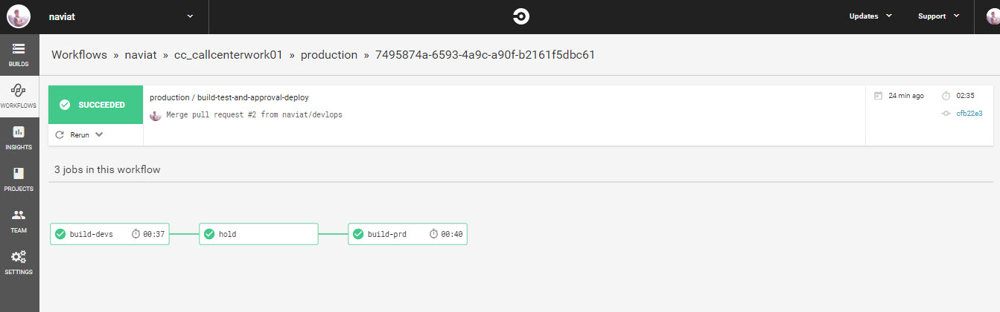

# Usage
Prerequisites:
* Your repo need to have 2 branches: `devlops` & `production`
* Create CodeDeply Application for each directory in repo (callcenter, work ..) and the EC2 target (for each environment)
# Workflow
1. Developer commit source code to `devlops` branch
1. Github create a trigger to CircleCI
1. CirlceCI call CodeDeploy Application to deploy source code to Dev Environment
1. After test Dev Environment, Developer create a pull request, git merge devlops to production branch.
1. Administrator approve in CircleCI
1. CircleCI process job in production branch
# Result

